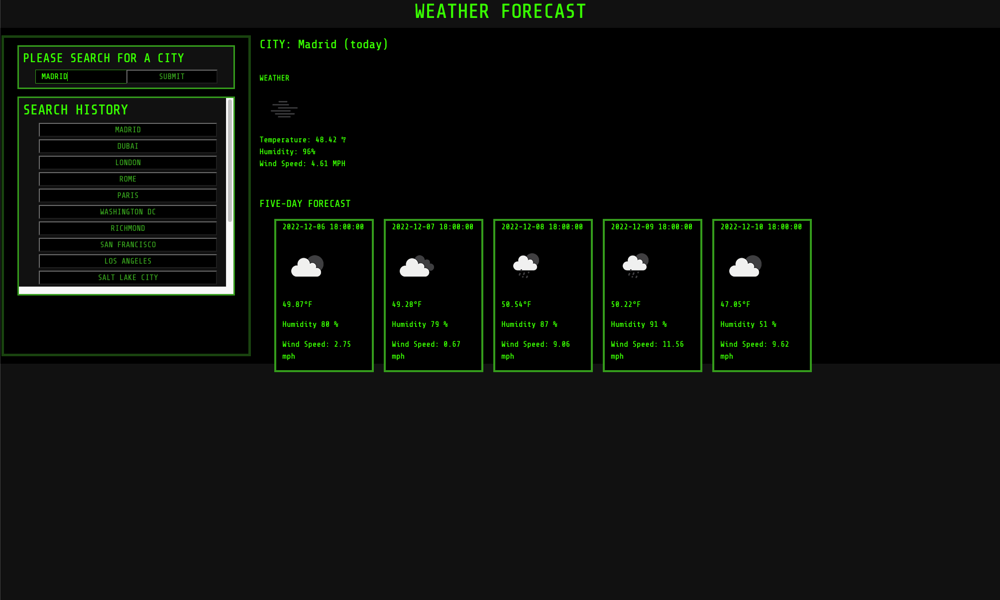

## README

# Mark Barstow / module-6-challenge

## Goals

### Using OpenWeatherAPI to display linked data to the web application
- In order to access data from the API, a key must be stored in a variable which will be called back in a fetch link.

        let APIKey = '1010101010101...'
    
    this example shows how the key is stored. it can be called back by concatenating it within the fetch link:

        let cityFetch = 'https://api.openweathermap.org/data/2.5/weather?appid='+ weatherAPIKey +'&q='+ city +'&units=imperial'

    In this example, the variable 'city' is called as well because that is a variable that stores user input.

- After the fetch request has been made, the data that is linked can be traversed much like an object.

- For this project, traversal was necessary to access the different weather conditions within the API for the specified city. Ex:

        currentCityEl.textContent = 'CITY: '+ data.name +' (today)';
        currentTempEl.textContent = 'Temperature: ' + data.main.temp + ' ℉';
        currentHumidityEl.textContent = 'Humidity: ' + data.main.humidity + '%';
        currentWindEl.textContent = 'Wind Speed: ' + data.wind.speed + " MPH";

### Utilization of localStorage in order to render search history to webpage

- This project required me to store city names within an array. In order to store a whole array within localStorage under one Key, the array must be manipulated:

        localStorage.setItem('history', JSON.stringify(historyArr))
    upon retrieval, however, this also means that the string must be converted back into an array using 
    
        JSON.parse()
    so that each index is placed in a seperate div:

        let historyArr = localStorage.getItem('history');
        historyArr = JSON.parse(historyArr);
        historyArr.reverse();
        removeChildNodes();
        for (let i = 0; i < historyArr.length; i++) {
            let historyItem = document.createElement('button');
            historyItem.textContent = historyArr[i];
            historyList.appendChild(historyItem);  
        }

## Challenges and Application

- The hardest part for this assignment was keeping the JavaScript organized when dealing with the task of rendering forecasts and weather conditions to the page. I believe there must be a way to use iteration in order to condense such lengthy and repetitive code up.
- Another problem I ran into was the occurence of duplicates within the search history. When the user types the same city twice, the code does not know how to respond to duplicate information since it cannot tell it's a duplicate. In order to fix this issue, I believe that a conditional statement must be used to tell wether the string typed into the input matches any of the other indices in the array.

## Webpage Deployment

- the link to the deployed GitHub Pages website is [here](https://marchetype.github.io/module-6-challenge/).

- Screenshot of deployed site:
